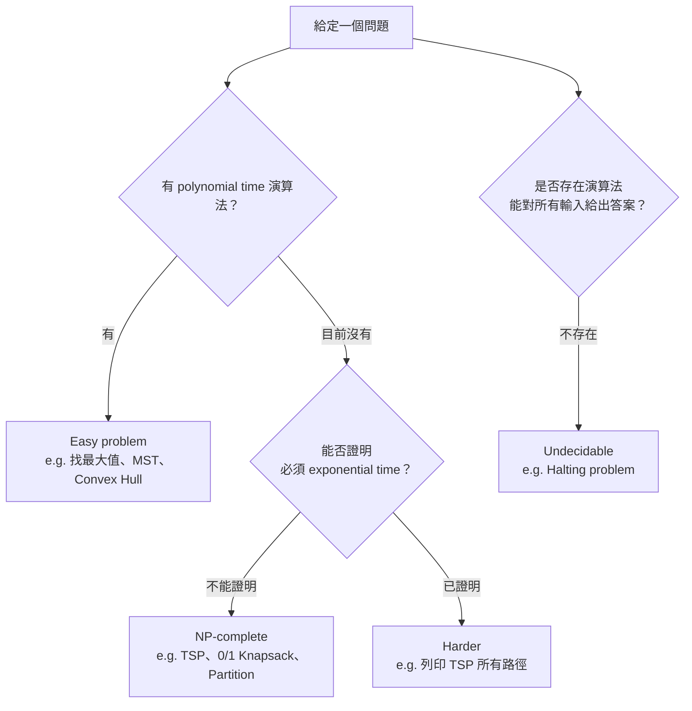

# Chapter 1 — Introduction

> Introduction to the Design and Analysis of Algorithms: A Strategic Approach（R.C.T. Lee, S.S. Tseng, R.C. Chang, Y.T. Tsang）
> 課程投影片：Algorithms（洪宗貝 Tzung-Pei Hong）

---

## 本章涵蓋主題

| 主題 | 說明 |
|---|---|
| 演算法（Algorithm） | 解決問題的步驟描述 |
| 學習演算法的目的 | 學會設計高效率演算法、理解某些問題本質上的困難 |
| 問題難度分類 | Polynomial time / NP-complete / 更難的問題 / Undecidable |
| 排序問題（Sorting） | 以 Insertion sort 與 Quick sort 示範「同一問題、不同解法」 |
| 演算法比較 | 好的演算法勝過快的硬體 |
| 演算法分析（Analysis） | Best / Worst / Average case、Amortized analysis、Lower / Upper bound |
| 經典 NP-complete 問題 | 0/1 Knapsack、TSP、Partition、Art Gallery |
| 最小生成樹（MST） | 看似困難、實際容易；以 Greedy method 求解 |
| 其他經典問題 | 1-Center、Convex Hull |

---

## 1. 什麼是演算法（What Is an Algorithm?）

演算法是**解決問題的一套步驟描述（procedure）**。

日常例子：「去上班」
1. 起床
2. 刷牙洗臉
3. 吃早餐
4. 穿衣
5. 準備公事包
6. 搭車

本課程關注的是：**電腦如何解決問題**。

### 問題與演算法的關係

同一個問題可以有多種解法（Approach 1, 2, 3, …）。

> 例：排序問題（Sorting Problem）
> `1, 3, 5, 4` → `1, 3, 4, 5`
> 可用 Insertion sort、Quick sort 等多種演算法完成。

---

## 2. 學習演算法的目的（Purpose）

| 目的 | 說明 |
|---|---|
| 學習設計策略 | 學會設計**有效率**演算法的各種策略（greedy、divide-and-conquer…） |
| 理解問題的困難度 | 知道某些問題**很難**設計出好的演算法，即 NP-complete 問題 |

代表例：**TSP（Traveling Salesman Problem）**——找出經過所有點的最短迴路（shortest circle）。

---

## 3. 問題難度分類

### 3.1 Polynomial Time 問題

執行時間為多項式，如 $O(n)$、$O(n^2)$ …，屬於「容易」的問題。

> 例：找最大值 `3, 5, 1, 6, 2` → 掃一遍即可，$O(n)$

### 3.2 NP-complete 問題

| 性質 | 說明 |
|---|---|
| 目前找不到 polynomial time 演算法 | 已知解法多為 $O(n!)$ 或 $O(2^n)$ |
| 也**無法證明**一定需要 exponential time | 可能存在更快解法，只是尚未找到 |

> **妾身未明**：NP-complete 問題的地位尚未確定——既沒被證明是簡單的，也沒被證明一定是難的。

### 3.3 比 NP-complete 更難的問題

| 類型 | 例子 | 為何更難 |
|---|---|---|
| 可證明需要 exponential time | 列印 TSP 的**每一條**可能路徑 | 輸出量本身就是指數級，不可能在多項式時間內完成 |
| Undecidable problem | 判斷任意程式是否會停止（Halting problem） | 不存在任何演算法能對所有程式回答 Yes（會停）/ No（不會停） |

### 3.4 分類流程圖



---

## 4. 排序問題（Sorting Problem）

將一組元素依遞增或遞減順序排列。

```
11, 7, 14, 1, 5, 9, 10
        ↓ sort
1, 5, 7, 9, 10, 11, 14
```

### 4.1 插入排序（Insertion Sort）

**概念**：從左到右，每次取一個元素，插入到已排序部分的正確位置（right place）。

以 `11, 7, 14, 1, 5, 9, 10` 為例：

| 步驟 | 插入元素 | 結果 |
|---|---|---|
| 0 | 11 | `11` |
| 1 | 7 | `7, 11` |
| 2 | 14 | `7, 11, 14`（只需和 11 比一次） |
| 3 | 1 | `1, 7, 11, 14` |
| 4 | 5 | `1, 5, 7, 11, 14` |
| 5 | 9 | `1, 5, 7, 9, 11, 14`（和 11、7 比兩次） |
| 6 | 10 | `1, 5, 7, 9, 10, 11, 14`（和 11、9 比兩次） |

> 資料若已接近排序，每次只需比較少數幾次，效率很好；最差情況則為 $O(n^2)$。

```cpp
void insertionSort(vector<int>& a) {
    for (int i = 1; i < a.size(); i++) {
        int key = a[i];           // 要插入的元素
        int j = i - 1;
        while (j >= 0 && a[j] > key) {
            a[j + 1] = a[j];      // 比 key 大的往右移
            j--;
        }
        a[j + 1] = key;           // 放到正確位置
    }
}
```

### 4.2 快速排序（Quick Sort）

**概念**：
1. 選第一個元素作為基準（pivot）
2. 將串列分成三組：`<` pivot、`=` pivot、`>` pivot
3. 對左右兩組**遞迴**執行相同步驟

以 `10, 5, 1, 17, 14, 8, 7, 26, 21, 3` 為例：

```
                 (10)  ← pivot
        ┌─────────┴──────────┐
 (5, 1, 8, 7, 3)      (17, 14, 26, 21)
   pivot = 5             pivot = 17
 (1,3) (5) (8,7)       (14) (17) (26,21)
   ↓         ↓                    ↓
 (1)(3)    (7)(8)              (21)(26)

Result: 1, 3, 5, 7, 8, 10, 14, 17, 21, 26
```

| 特性 | 說明 |
|---|---|
| 設計策略 | Divide and conquer |
| 實作方式 | Recursive |

```cpp
vector<int> quickSort(const vector<int>& a) {
    if (a.size() <= 1) return a;          // 終止條件
    int pivot = a[0];                     // 選第一個元素
    vector<int> less, equal, greater;
    for (int x : a) {
        if (x < pivot) less.push_back(x);
        else if (x == pivot) equal.push_back(x);
        else greater.push_back(x);
    }
    vector<int> result = quickSort(less); // 遞迴處理左半
    result.insert(result.end(), equal.begin(), equal.end());
    vector<int> right = quickSort(greater); // 遞迴處理右半
    result.insert(result.end(), right.begin(), right.end());
    return result;
}
```

---

## 5. 演算法的比較（Comparison of Algorithms）

> **壞演算法 + 快電腦** 不一定贏過 **好演算法 + 慢電腦**。
> 例：$O(n^2)$ 的演算法在超級電腦上，仍可能輸給 $O(n)$ 的演算法在普通電腦上。

### 實驗

| 演算法 | 執行環境 |
|---|---|
| Quick sort | 慢速電腦（投影片文字：Intel 486 PC；圖表標示：PC/XT） |
| Insertion sort | 快速電腦（投影片文字：IBM SP2 超級電腦；圖表標示：VAX8800） |

實驗圖表（橫軸：資料筆數，縱軸：秒數）顯示兩條曲線在中間某處交叉：

| 資料量 | 較佳者 | 原因 |
|---|---|---|
| 小 | Insertion sort | 常數小，加上硬體較快 |
| 大 | Quick sort | 成長速度慢（平均 $O(n \log n)$ vs. $O(n^2)$），最終超越硬體優勢 |

> **結論：演算法需要分析（Algorithms need analysis）。**

---

## 6. 演算法分析（Analysis of Algorithms）

演算法分析有兩大方向：

| 方向 | 內容 |
|---|---|
| 衡量**演算法**的好壞 | 以效率（efficiency）衡量，用 asymptotic notation 表示，如 $O(n^2)$ |
| 衡量**問題**的難度 | Polynomial time / NP-complete / Undecidable；分析 lower bound 與 upper bound |

### 6.1 效率依資料而異

同樣是排序，輸入不同，花費時間也不同：
- `1, 2, 3, 4, 5`（已排序）
- `1, 3, 5, 2, 4`（部分亂序）

### 6.2 效率的衡量方式（Efficiency）

| 分析方式 | 說明 |
|---|---|
| Best case | 最好情況下的時間 |
| Worst case | 最差情況下的時間 |
| Average case | 所有輸入的平均時間 |
| Amortized analysis | 看一連串操作的**總成本**，再平均到每次操作 |

### 6.3 攤銷分析（Amortized Analysis）

> 口訣：**零存整付／分期付款**——單次操作可能很貴，但攤到整串操作上，平均成本不高。

例：Stack 上的一連串操作

```
Push a, b
Push c, d
Pop  (1 個)
Pop  (3 個，一次彈出多個)
```

- 單次「一次彈出多個」的操作可能很貴
- 但**每個元素最多被 push 一次、pop 一次**
- 因此 $n$ 個元素的總成本：Push + Pop $\le 2n$，平均每次操作仍為常數

### 6.4 問題的 Lower Bound 與 Upper Bound

| 名詞 | 意義 |
|---|---|
| Upper bound | 目前**最佳演算法**的時間複雜度（已知做得到的程度） |
| Lower bound | 該**問題本身**至少需要的時間（任何演算法都無法更快） |

```
 ───────  Best algorithm（upper bound）
    ↓  兩者之間的差距 = 還有改進空間
    ↑
 ───────  Problem lower bound
```

> 當最佳演算法的複雜度 = 問題的 lower bound，該演算法即為 **optimal**。
> 若問題太難（如 NP-complete），可改求**近似解（approximate / heuristic）**。

---

## 7. 經典 NP-complete 問題

### 7.1 0/1 背包問題（0/1 Knapsack Problem）

**直觀描述**：有一個有重量上限的背包，每件物品有「重量」和「價值」，如何挑選物品使總價值最大？看似簡單，實則困難。

**正式定義**：
- 給定 $n$ 件物品，物品 $P_i$ 的價值為 $V_i$、重量為 $W_i$
- 總重量上限為 $M$
- 選出一個物品子集，使得
  - 總重量 $\le M$
  - 總價值最大

> 「0/1」表示每件物品只能**整件拿（1）或不拿（0）**，不可切割。

**範例**：$M = 14$，共 8 件物品

| 物品 | P1 | P2 | P3 | P4 | P5 | P6 | P7 | P8 |
|---|---|---|---|---|---|---|---|---|
| Value | 10 | 5 | 1 | 9 | 3 | 4 | 11 | 17 |
| Weight | 7 | 3 | 3 | 10 | 1 | 9 | 22 | 15 |

**最佳解**：P1, P2, P3, P5
- 總重量：$7 + 3 + 3 + 1 = 14 \le 14$ ✓
- 總價值：$10 + 5 + 1 + 3 = 19$

> 注意 P8 價值最高（17），但重量 15 已超過上限；P7 同理。只挑「價值高」的物品行不通。

### 7.2 旅行推銷員問題（Traveling Salesperson Problem, TSP）

| 項目 | 內容 |
|---|---|
| Given | 平面上 $n$ 個點 |
| Find | 一條**封閉路徑（closed tour）**，每個點恰好經過一次，且總長度最小 |
| 難度 | NP-complete |

### 7.3 分割問題（Partition Problem）

| 項目 | 內容 |
|---|---|
| Given | 一個正整數集合 $S$ |
| Find | 將 $S$ 分成 $S_1$、$S_2$，使兩者總和相等 |
| 難度 | NP-complete |

**正式定義**：找出 $S_1, S_2$ 使得

$$S_1 \cap S_2 = \varnothing,\quad S_1 \cup S_2 = S,\quad \sum_{i \in S_1} i = \sum_{i \in S_2} i$$

**範例**：$S = \{1, 7, 10, 4, 6, 8, 3, 13\}$

| 子集 | 元素 | 總和 |
|---|---|---|
| $S_1$ | {1, 10, 4, 8, 3} | 26 |
| $S_2$ | {7, 6, 13} | 26 |

### 7.4 美術館問題（Art Gallery Problem）

| 項目 | 內容 |
|---|---|
| Given | 一間美術館（以多邊形 polygon 表示） |
| Determine | 最少需要幾名警衛，以及他們的擺放位置，使整間美術館都能被監視 |
| 難度 | NP-complete |

---

## 8. 最小生成樹（Minimal Spanning Tree, MST）

### 8.1 樹與生成樹

| 名詞 | 定義 |
|---|---|
| Tree | 沒有 cycle 的圖，且所有點都相連 |
| Spanning tree | 包含原圖 $G$ **所有頂點**的樹；每條邊的權重（距離）與 $G$ 中對應邊 $e(V_i, V_j)$ 相同 |
| Minimal spanning tree | $G$ 的所有 spanning tree 中，**總權重最小**者 |

> 有 cycle 的圖不是樹（X）；無 cycle 且全連通才是樹（O）。

### 8.2 應用

美國電話公司：連接 5000 個城市，求**佈線總長度最短**的方式 → 最小生成樹。

### 8.3 暴力法：不可行

直觀做法：
1. 列出所有可能的 spanning tree
2. 計算每棵樹的總長度
3. 取最小值

問題：**組合爆炸（combinatorial explosion）**，成本極高。

$n$ 個點最多可能有 $n^{n-2}$ 棵 spanning tree（已被證明，即 Cayley's formula）：

| $n$ | Spanning tree 數量上限 |
|---|---|
| 10 | $10^{8}$ |
| 100 | $100^{98} = 10^{196}$ |

### 8.4 貪婪法（Greedy Method）

**步驟**：
1. 找出最短的一條邊，作為樹的起點
2. 從剩下的點中，挑出**離目前這棵樹最近**的點，把它接上
3. 重複步驟 2，直到所有點都加入

```
步驟①：最短邊      步驟②：接最近的點      步驟③：再接最近的點
  •─•         →      •─•─•           →      •─•─•
                                                  │
                                                  •
```

| 特性 | 說明 |
|---|---|
| 效率 | 通常很有效率 |
| 對 MST | **保證得到最佳解（optimal）** |
| 對其他問題 | **不一定最佳**，例如 TSP 用貪婪法未必得到最短路徑 |

---

## 9. 問題的「外表」會騙人

| 外表 | 實際 | 例子 |
|---|---|---|
| 看起來簡單 | 可能很難 | 0/1 Knapsack（NP-complete） |
| 看起來很難 | 可能很簡單 | Minimum spanning tree（polynomial time，greedy 即可） |

> **這正是需要學習演算法的原因**——憑直覺無法判斷問題難易，必須透過分析。

---

## 10. 其他經典問題

| 問題 | Given | Find | 難度 / 方法 |
|---|---|---|---|
| 1-Center Problem | $n$ 個點 | 能涵蓋所有點的**最小圓** | $O(n)$ |
| Convex Hull Problem | 平面上一組點 | 包含所有點的**最小凸多邊形** | Polynomial time，可用 divide-and-conquer |

---

## 11. 本書將介紹的設計策略

- Greedy approach（貪婪法）
- Divide-and-conquer approach（各個擊破）
- 以及其他策略……

---

## 重點整理

| 概念 | 重點 | 注意事項 |
|---|---|---|
| Algorithm | 解決問題的步驟描述 | 同一問題可有多種演算法 |
| Polynomial time | $O(n)$、$O(n^2)$ … | 視為「容易」的問題 |
| NP-complete | 目前只有 $O(2^n)$、$O(n!)$ 等解法 | 無法證明一定需要 exponential time（妾身未明） |
| 更難的問題 | 列印所有 TSP 路徑、Halting problem | Undecidable：根本不存在演算法 |
| Insertion sort | 逐一插入正確位置 | 小資料量表現好，最差 $O(n^2)$ |
| Quick sort | 選 pivot 分三組後遞迴 | Divide and conquer；大資料量表現好 |
| 演算法 vs. 硬體 | 好演算法 > 快硬體 | 資料量夠大時差距明顯 |
| Best / Worst / Average case | 依輸入不同分析效率 | 同一演算法在不同輸入下表現不同 |
| Amortized analysis | 看整串操作的總成本 | 零存整付；Push + Pop $\le 2n$ |
| Lower / Upper bound | 問題下限 vs. 最佳演算法 | 兩者相等 → 演算法為 optimal |
| 0/1 Knapsack | 重量限制下最大化總價值 | NP-complete；物品不可切割 |
| TSP | 經過每點一次的最短封閉路徑 | NP-complete；greedy 不保證最佳 |
| Partition | 將集合分成總和相等的兩半 | NP-complete |
| Art Gallery | 最少警衛監視整個多邊形 | NP-complete |
| MST | 總權重最小的 spanning tree | 暴力法有 $n^{n-2}$ 種；greedy 保證最佳 |
| 1-Center | 涵蓋所有點的最小圓 | $O(n)$ |
| Convex Hull | 包含所有點的最小凸多邊形 | Polynomial time（divide-and-conquer） |
