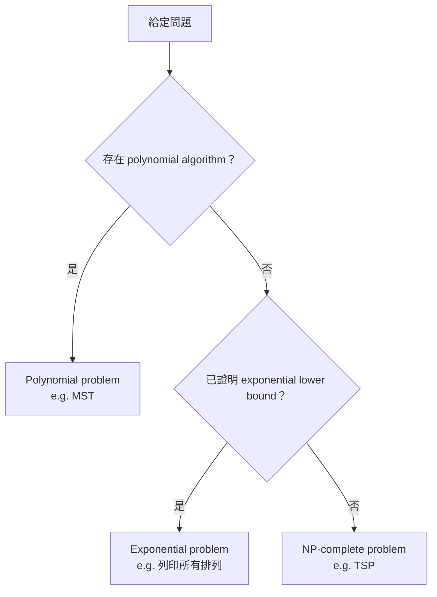

# Chapter 2 (Part 1) — The Complexity of Algorithms and The Lower Bounds of Problems

> Introduction to the Design and Analysis of Algorithms: A Strategic Approach（R.C.T. Lee, S.S. Tseng, R.C. Chang, Y.T. Tsang）
> 課程投影片：Algorithms（洪宗貝 Tzung-Pei Hong）

---

## 本節涵蓋主題

| 主題 | 說明 |
|---|---|
| 本章核心問題 | 演算法有沒有效率？問題難不難？演算法是否已經 optimal？ |
| 衡量演算法的方法 | 選定 basic step，計算所需步數 |
| Asymptotic notation（Big-O） | 以 $O(g(n))$ 描述 n 很大時步數的上限 |
| 係數的影響 | $O(n)$ 不一定永遠比 $O(n^3)$ 快，但 n 夠大時一定快 |
| 常見複雜度函數 | $O(1)$ 到 $O(n^n)$ 的成長速度比較 |
| Polynomial vs. Exponential | 演算法與問題的分類 |
| Straight insertion sort 分析 | 以 data movement 分析 best / worst / average case |
| Inversion table | 另一種分析 insertion sort 的方式 |
| Binary search 分析 | Best $O(1)$、Worst / Average $O(\log n)$，含數學證明 |

---

## 1. 本章要回答的問題（Outline）

| 對象 | 問題 |
|---|---|
| 演算法（Algorithm） | 有沒有效率？如何衡量？ |
| 問題（Problem） | 容不容易？如何衡量？ |
| 演算法 vs. 問題 | 這個演算法對該問題是否 optimal？如何得知？還有沒有更好的演算法？ |

---

## 2. 好演算法的標準（Good Algorithms）

| 標準 | 說明 |
|---|---|
| Correctness | 結果正確 |
| Short time to run | 執行時間短 |
| A small amount of memory | 使用記憶體少 |

> 本書主要考慮**時間（time）**這個標準。

---

## 3. 如何衡量演算法（How to Measure）

### 3.1 直觀做法：寫程式實際跑（不可靠）

寫出程式、測量實際執行時間（例如 1000 ms、10 min）。
問題是影響效能的因素太多：

- 程式設計師的能力
- 使用的程式語言
- 作業系統（O.S.）
- 編譯器（Compiler）
- 電腦硬體能力
- ……

### 3.2 正式做法：演算法分析（Formal Algorithm Analysis）

1. **選定一個 basic step**，例如 data comparison（`5 ←→ 6`，判斷 `<`、`>`、`=`）
2. **分析需要多少個 basic step**，例如需要 100 次 data comparison

### 3.3 排序問題的兩種 basic step

| Basic step | 適用情境 |
|---|---|
| Data comparison | 一般情況，比較兩筆資料大小 |
| Data movement | 資料搬移成本高時，例如資料不在記憶體中（存在磁碟） |

> 要選哪一種 basic step，取決於**排序問題本身與執行環境**。

---

## 4. 時間複雜度（Time Complexity）

### 4.1 分析類型

| 類型 | 說明 | 分析難度 |
|---|---|---|
| Best-case | 最好情況 | 最容易 |
| Worst-case | 最差情況 | 次容易 |
| Average-case | 平均情況 | 最難 |
| Amortized | 一連串操作的平均成本 | — |

### 4.2 與問題大小有關

時間複雜度取決於**問題的大小（size）**。
> 例：TSP 的 size 為城市數量；size ↑ → 執行時間 ↑

### 4.3 只看最高次項

若演算法需要 $(n^3 + n)$ 步，當 n 很大時（例如 $n = 1000$）：

$$n^3 + n \approx n^3 \quad\Rightarrow\quad O(n^3)$$

正式的描述方式即 **asymptotic notation**。

---

## 5. 漸近符號（Asymptotic Notation）

### 5.1 定義

$$f(n) = O(g(n)) \iff \exists\, c, n_0 \text{ 使得 } |f(n)| \le c\,|g(n)|,\quad \forall\, n \ge n_0$$

> **意義**：所花的步數 $f(n)$，當 n 夠大時，**最多**為 $g(n)$ 的某個常數倍。
> **O 代表 "at most"**（上限）。

### 5.2 例題：證明 $n^3 + n = O(n^3)$

$$f(n) = n^3 + n = \left(1 + \frac{1}{n^2}\right) n^3$$

因為當 $n \ge 1$ 時 $\dfrac{1}{n^2} \le 1$，所以

$$1 + \frac{1}{n^2} \le 2 \quad\Rightarrow\quad f(n) \le 2n^3$$

取 $c = 2$、$n_0 = 1$，得 $f(n) = O(n^3)$，其中 $g(n) = n^3$。

### 5.3 $g(n)$ 不唯一

$$f(n) = 3n^2 + 2 = O(n^2) = O(n^3) = O(n^{100}) = \cdots$$

以上寫法依定義**全部成立**，但：

> **一般取最小的 $g(n)$**：$f(n) = 3n^2 + 2 = O(n^2)$

---

## 6. 係數的影響（The Effect of the Coefficient）

定義中的 $|f(n)| \le c\,|g(n)|$，常數 $c$ 在 n 小時也很重要。

### 例：哪個比較快？

| 演算法 | 複雜度 | 每步時間 | 總時間 |
|---|---|---|---|
| A1 | $O(n^3)$ | 1 單位 | $1 \times n^3$ |
| A2 | $O(n)$ | 100 單位 | $100 \times n$ |

令 $n^3 = 100n$，得交叉點 $n = 10$：

| 條件 | 結果 |
|---|---|
| $n < 10$ | A1 < A2（A1 較快） |
| $n = 10$ | A1 = A2 |
| $n > 10$ | A1 > A2（**A2 較快**） |

> **結論**：$O(n)$ 的演算法**不一定**永遠比 $O(n^3)$ 快；但當 n 夠大時，**不論係數 c 為何**，$O(n)$ 一定勝出。

---

## 7. 常見時間複雜度函數

### 7.1 成長速度比較表

| $g(n)$ \ n | 10 | $10^2$ | $10^3$ | $10^4$ |
|---|---|---|---|---|
| $\log_2 n$ | 3.3 | 6.6 | 10 | 13.3 |
| $n$ | 10 | $10^2$ | $10^3$ | $10^4$ |
| $n\log_2 n$ | $0.33 \times 10^2$ | $0.7 \times 10^3$ | $10^4$ | $1.3 \times 10^5$ |
| $n^2$ | $10^2$ | $10^4$ | $10^6$ | $10^8$ |
| $2^n$ | 1024 | $1.3 \times 10^{30}$ | $> 10^{100}$ | $> 10^{100}$ |
| $n!$ | $3 \times 10^6$ | $> 10^{100}$ | $> 10^{100}$ | $> 10^{100}$ |

（表格由上往下越來越大；$10! = 3{,}628{,}800 \approx 3.6 \times 10^6$）

投影片 Rate of Growth 圖以 $\log_2$ 座標畫出各函數，可看出 $2^n$、$n^3$ 的曲線遠比 $n\log n$、$n$、$\log n$ 陡峭。

### 7.2 由小到大排列

$$O(1) < O(\log n) < O(n) < O(n\log n) < O(n^2) < O(n^3) < O(2^n) < O(n!) < O(n^n)$$

> 對同一個問題，目標是找出**時間複雜度更低**的演算法。

### 7.3 例：搜尋問題（Searching Problem）

在 `1, 3, 5, 7, 9, 10, 12, 14` 中找 9 的位置：

| 方法 | 做法 | 前提 | 複雜度 |
|---|---|---|---|
| Sequential search | 從頭逐一比對 | 無 | $O(n)$ |
| Binary search | 每次取中間元素比對 | **資料已排序** | $O(\log n)$ |

當 $n = 10^4$：
- $O(n) = 10^4$
- $O(\log n) = \log_2 10^4 \approx 14$

### 7.4 Polynomial vs. Exponential

$n^2, n^3, \dots, n^c$ 雖然複雜度高，但仍**遠小於** $2^n$、$n!$。
> 例：$n = 10^4$ 時，$n^2 = 10^8$，而 $2^n > 10^{100}$。

| 類別 | 函數 |
|---|---|
| Polynomial time | $n^2, n^3, \dots, n^c$ |
| Exponential time | $2^n, n!$ |

---

## 8. 演算法與問題的分類

### 8.1 演算法分類

| 類別 | 定義 |
|---|---|
| Polynomial algorithm | 時間複雜度為 $O(p(n))$，其中 $p(n)$ 為多項式函數 |
| Exponential algorithm | 時間複雜度**無法**被任何多項式函數界定 |

### 8.2 問題分類

| 類別 | 條件 | 例子 |
|---|---|---|
| Polynomial problem | 存在 polynomial algorithm | Minimal spanning tree |
| Exponential problem | 已證明 lower bound 為 exponential | 列印所有排列（printing all permutations） |
| NP-complete problem | 沒有 polynomial algorithm，**也**沒有被證明的 exponential lower bound | TSP |



> 另外，**執行時間也與資料內容有關**（見下一節）。

---

## 9. 直接插入排序（Straight Insertion Sort）

### 9.1 比較次數依資料而異

假設新元素**由後往前**比較。

**例 1**：輸入 `7, 5, 1, 4, 3`

| 步驟 | 結果 | 比較次數 |
|---|---|---|
| A | `5, 7` | 1 |
| B | `5, 1, 7` → `1, 5, 7` | 2 |
| C | `1, 4, 5, 7` | 3 |
| D | `1, 3, 4, 5, 7` | 4 |
| | | **共 10 次** |

**例 2**：輸入 `1, 3, 4, 5, 7`（已排序）

| 步驟 | 結果 | 比較次數 |
|---|---|---|
| A | `1, 3` | 1 |
| B | `1, 3, 4` | 1 |
| C | `1, 3, 4, 5` | 1 |
| D | `1, 3, 4, 5, 7` | 1 |
| | | **共 4 次** |

> 同一演算法、同樣大小的輸入，步數可以差很多 → **Depending on data**

### 9.2 Algorithm 2.1

```pascal
Input:  x1, x2, ..., xn
Output: The sorted sequence of x1, x2, ..., xn

For j := 2 to n do
Begin
    i := j - 1
    x := xj                       { 取出第 j 個元素：1 次 movement }
    While x < xi and i > 0 do
    Begin
        x(i+1) := xi              { 比 x 大的往右移：共 dj 次 movement }
        i := i - 1
    End
    x(i+1) := x                   { 放回正確位置：1 次 movement }
End
```

**追蹤**：`7 5 1 4 2 3 6`
- $j = 2$：→ `5 7 1 4 2 3 6`
- $j = 3$，$x = x_3 = 1$：
  - `5, ○, 7`（7 右移）
  - `○, 5, 7`（5 右移）
  - `1, 5, 7`（放入 1）

### 9.3 Data Movement 分析

令 $M$ 為 data movement 總次數。每一輪 $j$ 的 movement 次數為 $2 + d_j$：

$$M = \sum_{j=2}^{n}(2 + d_j) = 2(n-1) + \sum_{j=2}^{n} d_j$$

> **$d_j$ 的定義**：第 $j$ 個元素**左邊**比它大的元素個數（即 while 迴圈執行的次數）。

**例**：輸入 `7, 5, 1, 4`

| $j$ | 插入元素 | 左邊比它大的 | $d_j$ | 結果 |
|---|---|---|---|---|
| 2 | 5 | 7 | 1 | `5, 7, 1, 4` |
| 3 | 1 | 5, 7 | 2 | `1, 5, 7, 4` |
| 4 | 4 | 5, 7 | 2 | `1, 4, 5, 7` |

### 9.4 Best Case

輸入已排序（例：`1, 2, 3, 4`），所有 $d_j = 0$：

$$M = 2(n-1) + 0 = O(n)$$

### 9.5 Worst Case

輸入反向排序（例：`4, 3, 2, 1`），$d_j = j - 1$：

$$\begin{aligned}
M &= 2(n-1) + \sum_{j=2}^{n}(j-1) \\
  &= 2(n-1) + \big(1 + 2 + 3 + \cdots + (n-1)\big) \\
  &= 2(n-1) + \frac{n(n-1)}{2} = O(n^2)
\end{aligned}$$

### 9.6 Average Case

$x_j$ 左邊有 $j-1$ 個元素，$x_j$ 在這 $j$ 個元素中的大小排名決定 $d_j$：

| $x_j$ 的排名 | $d_j$ |
|---|---|
| 最大 | 0 |
| 第二大 | 1 |
| ⋮ | ⋮ |
| 第二小 | $j - 2$ |
| 最小 | $j - 1$ |

假設每種情況機率相同，皆為 $\frac{1}{j}$，則 $d_j$ 的期望值：

$$\begin{aligned}
\bar{d_j} &= \frac{1}{j}\times 0 + \frac{1}{j}\times 1 + \cdots + \frac{1}{j}\times(j-1) \\
&= \frac{1}{j}\cdot\frac{j(j-1)}{2} = \frac{j-1}{2}
\end{aligned}$$

代回 $M$：

$$\begin{aligned}
M &= 2(n-1) + \sum_{j=2}^{n}\frac{j-1}{2} \\
  &= 2(n-1) + \frac{1}{2}\big(1 + 2 + \cdots + (n-1)\big) \\
  &= 2(n-1) + \frac{1}{2}\cdot\frac{n(n-1)}{2} = O(n^2)
\end{aligned}$$

### 9.7 小結

| 情況 | Data movement | 輸入特徵 |
|---|---|---|
| Best case | $O(n)$ | 已排序 |
| Worst case | $O(n^2)$ | 反向排序 |
| Average case | $O(n^2)$ | 隨機，平均 $d_j = \frac{j-1}{2}$ |

> Straight insertion sort 的**時間複雜度與 data movement 相同**。

---

## 10. 另一種分析：反序表（Inversion Table）

### 10.1 定義

把待排序的串列視為 $\{1, 2, \dots, n\}$ 的一個排列（permutation）。

- $(a_1, a_2, \dots, a_n)$：一個 permutation
- $(d_1, d_2, \dots, d_n)$：其 inversion table
- $d_j$：**數值 $j$** 在 permutation 中所在位置的左邊，比 $j$ 大的元素個數

> ⚠️ **注意**：是比「**數值 $j$**」大，不是比「第 $j$ 個位置的 $a_j$」大。

### 10.2 例子

**例 1**：permutation `(7 5 1 4 3 2 6)`

| 數值 $j$ | 左邊比 $j$ 大的元素 | $d_j$ |
|---|---|---|
| 1 | 7, 5 | 2 |
| 2 | 7, 5, 4, 3 | 4 |
| 3 | 7, 5, 4 | 3 |
| 4 | 7, 5 | 2 |
| 5 | 7 | 1 |
| 6 | 7 | 1 |
| 7 | — | 0 |

→ inversion table = `(2 4 3 2 1 1 0)`

**例 2**：permutation `(7 6 5 4 3 2 1)` → inversion table = `(6 5 4 3 2 1 0)`

### 10.3 為什麼可以用 Inversion Table 分析

Inversion table 的 $d_i$（以**數值**為索引）與第 9 節的 $d_j$（以**位置**為索引）意義不同，但**總和相等**：

$$\sum d_i = \sum d_j$$

**驗證**：permutation `(7 5 1 4 3 2 6)`

| | 值 | 總和 |
|---|---|---|
| Inversion table（依數值） | `(2 4 3 2 1 1 0)` | 13 |
| 第 9 節的 $d_j$（依位置） | `(0 1 2 2 3 4 1)` | 13 |

> 原因：兩者都在數同一組「逆序對」，只是記錄的索引方式不同，因此第 9 節的結果是 inversion table 的**另一種排列**。

所以 $M$ 可改寫為：

$$M = 2(n-1) + \sum_{i=1}^{n} d_i$$

### 10.4 Best Case

已排序，例：`(1, 2, 3, 4)` → inversion table `(0, 0, 0, 0)`，所有 $d_i = 0$：

$$M = 2(n-1) + 0 = O(n)$$

### 10.5 Worst Case

反向排序，例：`(4, 3, 2, 1)` → inversion table `(3, 2, 1, 0)`

$$d_1 = n-1,\ d_2 = n-2,\ \dots,\ d_i = n-i,\ \dots,\ d_n = 0$$

$$M = 2(n-1) + \sum_{i=1}^{n}(n-i) = 2(n-1) + \frac{n}{2}(n-1) = O(n^2)$$

### 10.6 Average Case

用 inversion table 不好想 → **用第 9 節的方法分析較容易**。

---

## 11. 二元搜尋（Binary Search）

### 11.1 做法

前提：資料**已排序**。每次取**中間元素**比較，依結果捨棄一半。

**例**：在 `1 4 5 7 9 10 12 15` 中找 9

| 步驟 | 搜尋範圍（索引） | 中間位置 | 中間值 | 判斷 |
|---|---|---|---|---|
| 1 | 1 ~ 8 | $\lfloor 9/2 \rfloor = 4$ | 7 | 9 > 7，往右 |
| 2 | 5 ~ 8 | $\lfloor 13/2 \rfloor = 6$ | 10 | 9 < 10，往左 |
| 3 | 5 ~ 5 | 5 | 9 | 找到 |

### 11.2 實作細節

使用兩個變數 `begin`、`end` 記錄範圍，每次要找的元素為第

$$\left\lfloor \frac{begin + end}{2} \right\rfloor$$

個。例：$(1+8)/2 = 4.5$ → 取 4（**取較前面**的）。

### 11.3 演算法

```pascal
Input:  A sorted array a1, a2, ..., an, and x
Output: j if aj = x and 0 if no j exists

i := 1                 { first entry }
m := n                 { last entry }
while i ≤ m do
Begin
    j := ⌊(i + m) / 2⌋
    If x = aj then output j and stop
    If x < aj then m := j - 1      { 往左半找 }
    else i := j + 1                { 往右半找 }
End
j := 0                             { 找不到 }
output j
```

```cpp
int binarySearch(const vector<int>& a, int x) {   // a 以 1-indexed 思考，a[0] 不用
    int i = 1, m = a.size() - 1;
    while (i <= m) {
        int j = (i + m) / 2;          // 整數除法自動取 floor
        if (x == a[j]) return j;
        if (x < a[j]) m = j - 1;      // 往左
        else i = j + 1;               // 往右
    }
    return 0;                         // 找不到
}
```

### 11.4 時間複雜度

| 情況 | 比較次數 | 複雜度 |
|---|---|---|
| Best case | 1（第一次就命中中間元素） | $O(1)$ |
| Worst case | $\lfloor \log_2 n \rfloor + 1$ | $O(\log n)$ |
| Average case | 見下方證明 | $O(\log n)$ |

---

## 12. Binary Search 的 Average Case 證明

### 12.1 以二元樹表示搜尋過程

假設 $n = 2^k - 1$，例：$k = 4 \Rightarrow n = 15$

```
                  8                ← 找 1 次：1 個 case
            /           \
          4               12       ← 找 2 次：2 個 cases
        /   \           /    \
       2     6        10      14   ← 找 3 次：4 個 cases
      / \   / \      /  \    /  \
     1   3 5   7    9   11  13  15 ← 找 4 次：8 個 cases
    ↑ ↑ ↑ ↑ ↑ ↑ ↑  ↑ ↑ ↑  ↑ ↑ ↑  ↑ ↑ ↑
    （16 個找不到的位置，都要找 4 次）
```

| 類型 | Case 數 | 比較次數 |
|---|---|---|
| 成功（successful） | $n$（第 $i$ 層有 $2^{i-1}$ 個，各需 $i$ 次） | $i$ |
| 失敗（unsuccessful） | $n + 1$ | $k$ |

其中 $k = \lfloor \log n \rfloor + 1$，代表**樹的層數**。

### 12.2 平均比較次數

假設 $2n + 1$ 種情況機率相同：

$$A(n) = \frac{1}{2n+1}\left(\sum_{i=1}^{k} i \cdot 2^{i-1} + k(n+1)\right)$$

- 前項：所有成功搜尋的比較次數總和
- 後項：所有失敗搜尋的比較次數總和

### 12.3 關鍵等式

需要先證明：

$$\sum_{i=1}^{k} i \cdot 2^{i-1} = 2^k(k-1) + 1$$

#### 方法一：數學歸納法（By Induction）

步驟：證 $k = 1$ 成立 → 假設 $k = m$ 成立 → 證 $k = m+1$ 也成立。

**(1) $k = 1$**
- 左式：$\sum_{i=1}^{1} i \cdot 2^{i-1} = 1 \times 2^0 = 1$
- 右式：$2^1(1-1) + 1 = 1$
- 左式 = 右式 ✓

**(2) 假設 $k = m$ 成立**

$$\sum_{i=1}^{m} i \cdot 2^{i-1} = 2^m(m-1) + 1$$

**(3) 證 $k = m+1$**（把第 $m+1$ 項獨立出來）

$$\begin{aligned}
\sum_{i=1}^{m+1} i \cdot 2^{i-1} &= \sum_{i=1}^{m} i \cdot 2^{i-1} + (m+1)2^{m} \\
&= 2^m(m-1) + 1 + (m+1) \cdot 2^m \\
&= (2^m \cdot 2m) + 1 = 2^{m+1} m + 1 \\
&= 2^{m+1}\big((m+1) - 1\big) + 1 = \text{右式} \checkmark
\end{aligned}$$

#### 方法二：微積分（By Calculus）

**(1) 等比級數公式**

$$x^0 + x^1 + x^2 + \cdots + x^k = \sum_{i=0}^{k} x^i = \frac{x^{k+1} - 1}{x - 1}$$

**(2) 兩邊微分**

$$1 + 2x + 3x^2 + \cdots + kx^{k-1} = \sum_{i=0}^{k} i x^{i-1}$$

**(3) 求出左式的封閉形式**

令 $y = 1 + 2x + 3x^2 + \cdots + kx^{k-1}$，則

$$xy = x + 2x^2 + 3x^3 + \cdots + kx^k$$

兩式相減：

$$\begin{aligned}
y - xy &= 1 + x + x^2 + \cdots + x^{k-1} - kx^k \\
&= (1 + x + \cdots + x^{k-1} + x^k) - x^k - kx^k \\
&= \frac{x^{k+1} - 1}{x - 1} - (k+1)x^k \\
&= \frac{(x^{k+1} - 1) - (x-1)(k+1)x^k}{x - 1}
\end{aligned}$$

因為 $y - xy = (1-x)y$，得

$$y = \sum_{i=0}^{k} i x^{i-1} = \frac{(x-1)(k+1)x^k - (x^{k+1} - 1)}{(x-1)^2}$$

**(4) 代入 $x = 2$**

$$\begin{aligned}
\sum_{i=0}^{k} i \cdot 2^{i-1} &= \frac{(2-1)(k+1)2^k - (2^{k+1} - 1)}{(2-1)^2} \\
&= (k+1)2^k - (2 \cdot 2^k - 1) \\
&= (k+1-2)2^k + 1 \\
&= 2^k(k-1) + 1 \checkmark
\end{aligned}$$

（$i = 0$ 那項為 0，所以從 $i=0$ 或 $i=1$ 開始加結果相同。）

### 12.4 代回 $A(n)$

利用 $n = 2^k - 1$（即 $n + 1 = 2^k$）：

$$\begin{aligned}
A(n) &= \frac{1}{2n+1}\Big[2^k(k-1) + 1 + k \cdot 2^k\Big] \\
&= \frac{1}{2n+1}\Big[2^k(2k-1) + 1\Big] \\
&= \frac{1}{2(2^k - 1) + 1}\Big[2^k(2k-1) + 1\Big] \\
&= \frac{1}{2 \cdot 2^k - 1}\Big[2^k(2k-1) + 1\Big]
\end{aligned}$$

### 12.5 求漸近結果

當 $n \uparrow$，$k \uparrow$：

$$\begin{aligned}
A(n) &\approx \frac{1}{2 \cdot 2^k}\Big[2^k(2k-1) + 1\Big] \\
&< \frac{1}{2 \cdot 2^k}\Big[2^k \cdot 2k\Big] = k
\end{aligned}$$

$$\Rightarrow A(n) = O(k) = O(\log n)$$

> **嚴謹推導**：「≈」那步可改用「小於它的兩倍」，即 $\dfrac{1}{2\cdot 2^k - 1} \le \dfrac{2}{2 \cdot 2^k}$（$k \ge 1$），得 $A(n) < 2k$，結論仍為 $O(\log n)$。

---

## 重點整理

| 概念 | 重點 | 注意事項 |
|---|---|---|
| 好演算法三標準 | Correctness、時間短、記憶體少 | 本書只考慮時間 |
| 衡量方式 | 選 basic step 並計算步數 | 不用實際執行時間（受太多因素影響） |
| 排序的 basic step | Data comparison / Data movement | 依問題與環境選擇 |
| 分析難度 | Best < Worst < Average | Average case 最難分析 |
| $f(n) = O(g(n))$ | $\exists\, c, n_0$，$\forall n \ge n_0$，$\lvert f(n)\rvert \le c\lvert g(n)\rvert$ | O = at most；$g(n)$ 不唯一，取最小 |
| 係數 $c$ | n 小時會影響誰快 | n 夠大時，低複雜度必勝 |
| 複雜度排序 | $1 < \log n < n < n\log n < n^2 < n^3 < 2^n < n! < n^n$ | Polynomial 遠小於 exponential |
| Polynomial problem | 存在 polynomial algorithm | 例：MST |
| Exponential problem | 已證明 exponential lower bound | 例：列印所有排列 |
| NP-complete | 無 polynomial algorithm，也無 exponential lower bound 證明 | 例：TSP |
| Insertion sort 的 $M$ | $M = 2(n-1) + \sum d_j$ | $d_j$ = 第 $j$ 個元素左邊比它大的個數 |
| Insertion sort 複雜度 | Best $O(n)$、Worst $O(n^2)$、Average $O(n^2)$ | Average 的 $d_j$ 期望值 $= \frac{j-1}{2}$ |
| Inversion table | $d_j$ = 數值 $j$ 左邊比 $j$ 大的個數 | 比「數值 $j$」大，不是比 $a_j$ 大；$\sum d_i = \sum d_j$ |
| Binary search | 已排序資料，每次取 $\lfloor(begin+end)/2\rfloor$ | 取較前面的元素 |
| Binary search 複雜度 | Best $O(1)$、Worst $\lfloor\log_2 n\rfloor + 1$、Average $O(\log n)$ | 成功 $n$ 種 + 失敗 $n+1$ 種，共 $2n+1$ 種 |
| 關鍵等式 | $\sum_{i=1}^{k} i \cdot 2^{i-1} = 2^k(k-1) + 1$ | 可用歸納法或微積分（等比級數微分）證明 |
