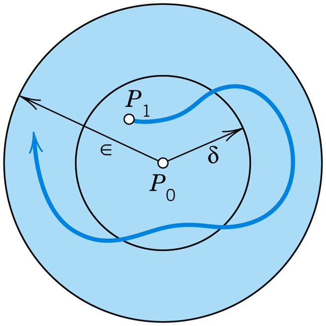
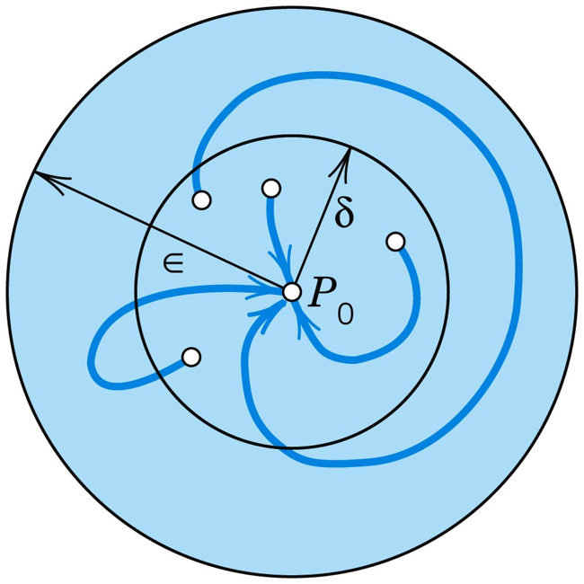

# 4.4 臨界點的判別準則與穩定性（Criteria for Critical Points. Stability）

> Engineering Mathematics — Chapter 4: Systems of ODEs, Phase Plane, Qualitative Methods

---

## 本節涵蓋主題

| 主題 | 說明 |
|---|---|
| p、q、Δ 與特徵值的關係 | 用跡數與行列式直接描述臨界點類型 |
| Table 4.1 — 臨界點類型判別表 | 以 p、q、Δ 分類節點、鞍點、中心、螺旋點 |
| 穩定性定義 | Stable、Unstable、Stable and Attractive（漸近穩定）三種 |
| Table 4.2 — 穩定性判別表 | 以 p、q 判斷穩定性 |
| 穩定性圖（Stability Diagram） | pq 平面上的區域對應各類臨界點 |
| 工程應用範例 | 彈簧質量系統、RLC 電路、中心的擾動 |

---

## 1. p、q、Δ 與特徵值的關係

對 $2 \times 2$ 系統 $\mathbf{y}' = \mathbf{A}\mathbf{y}$，特徵方程式為：

$$\det(\mathbf{A} - \lambda\mathbf{I}) = \lambda^2 - (a_{11}+a_{22})\lambda + \det\mathbf{A} = 0$$

定義三個關鍵量：

$$p = a_{11} + a_{22} = \lambda_1 + \lambda_2 \quad \text{（跡數，Trace）}$$

$$q = \det\mathbf{A} = \lambda_1\lambda_2 \quad \text{（行列式，Determinant）}$$

$$\Delta = p^2 - 4q = (\lambda_1 - \lambda_2)^2 \quad \text{（判別式，Discriminant）}$$

特徵方程式化為：

$$\lambda^2 - p\lambda + q = 0$$

> **核心思想：** 只需計算 p 和 q 兩個數，即可完全確定 $2 \times 2$ 系統的臨界點類型與穩定性，無需真正求解特徵值。

---

## 2. Table 4.1 — 臨界點類型判別表

| 臨界點類型 | $p = \lambda_1 + \lambda_2$ | $q = \lambda_1\lambda_2$ | $\Delta = (\lambda_1-\lambda_2)^2$ | 特徵值特性 |
|---|---|---|---|---|
| **(a) 節點（Node）** | 任意 | $q > 0$ | $\Delta \geq 0$ | 實數，**同號** |
| **(b) 鞍點（Saddle Point）** | 任意 | $q < 0$ | 任意 | 實數，**異號** |
| **(c) 中心（Center）** | $p = 0$ | $q > 0$ | $\Delta < 0$ | **純虛數** |
| **(d) 螺旋點（Spiral Point）** | $p \neq 0$ | $q > 0$ | $\Delta < 0$ | 複數，實部 ≠ 0 |

**判斷步驟：**
```
Step 1：計算 q = det(A)
         q < 0 → 鞍點（停止）
         q > 0 → 繼續

Step 2：計算 Δ = p² − 4q
         Δ ≥ 0 → 節點（Improper 或 Proper）
         Δ < 0 → 繼續

Step 3：檢查 p
         p = 0 → 中心
         p ≠ 0 → 螺旋點
```

---

## 3. 穩定性定義（Definitions）

設 $P_0$ 為 $\mathbf{y}' = \mathbf{A}\mathbf{y}$ 的臨界點：

### 3.1 穩定（Stable）

對任意以 $P_0$ 為中心、半徑 $\varepsilon > 0$ 的圓盤 $D_\varepsilon$，存在以 $P_0$ 為中心、半徑 $\delta > 0$ 的圓盤 $D_\delta$，使得：

> 凡在 $t = t_1$ 時處於 $D_\delta$ 內的軌跡，在所有 $t \geq t_1$ 時刻均保持在 $D_\varepsilon$ 內。

**直白理解：** 起點夠靠近 $P_0$，則未來永遠不會跑太遠。



### 3.2 不穩定（Unstable）

$P_0$ 不是穩定的（存在某些起點近 $P_0$ 的軌跡會遠離）。

### 3.3 漸近穩定（Stable and Attractive / Asymptotically Stable）

$P_0$ 是穩定的，**且**所有起點在 $D_\delta$ 內的軌跡滿足：

$$\mathbf{y}(t) \to P_0 \quad \text{as } t \to \infty$$

**直白理解：** 不只不會跑遠，還會主動趨近 $P_0$（類比：有磁力的平衡點）。



```
漸近穩定 ⊂ 穩定
穩定 ⊄ 漸近穩定（中心：穩定但不漸近穩定）
```

---

## 4. Table 4.2 — 穩定性判別表

| 穩定性類型 | $p = \lambda_1 + \lambda_2$ | $q = \lambda_1\lambda_2$ |
|---|---|---|
| **(a) 漸近穩定（Stable and Attractive）** | $p < 0$ | $q > 0$ |
| **(b) 穩定（Stable）** | $p \leq 0$ | $q > 0$ |
| **(c) 不穩定（Unstable）** | $p > 0$ **或** $q < 0$ | |

**物理詮釋：**
- $q > 0$（$\lambda_1\lambda_2 > 0$）：特徵值同號，軌跡不穿越原點 → 穩定的基本條件
- $p < 0$（$\lambda_1 + \lambda_2 < 0$）：特徵值實部之和為負 → 衰減，漸近穩定
- $p = 0$：中心，僅穩定不漸近（軌跡繞行不趨近）
- $q < 0$：鞍點，永遠不穩定

---

## 5. 穩定性圖（Stability Diagram）

在 pq 平面上，各類臨界點的分布如下：

![[4.4.3.png]]

| 區域 | 臨界點類型 | 穩定性 |
|---|---|---|
| $q < 0$（p 軸以下） | 鞍點 | 永遠不穩定 |
| $q > 0,\; p < 0,\; \Delta > 0$ | 穩定節點（Stable Node / Sink） | 漸近穩定 |
| $q > 0,\; p > 0,\; \Delta > 0$ | 不穩定節點（Unstable Node / Source） | 不穩定 |
| $q > 0,\; p < 0,\; \Delta < 0$ | 穩定螺旋（Stable Spiral） | 漸近穩定 |
| $q > 0,\; p > 0,\; \Delta < 0$ | 不穩定螺旋（Unstable Spiral） | 不穩定 |
| $q > 0,\; p = 0,\; \Delta < 0$ | 中心（Center） | 穩定（非漸近） |
| $\Delta = 0$（拋物線 $q = p^2/4$） | 退化節點或正規節點 | 視 p 正負 |

---

## 6. 工程應用範例

### 6.1 Example 1 — 直接套用判別表

$$\mathbf{y}' = \begin{bmatrix}-3 & 1\\1 & -3\end{bmatrix}\mathbf{y}$$

$$p = -3 + (-3) = -6, \quad q = (-3)(-3) - (1)(1) = 8, \quad \Delta = (-6)^2 - 4(8) = 4$$

- $q = 8 > 0$，$\Delta = 4 \geq 0$ → **節點（Node）**
- $p = -6 < 0$，$q = 8 > 0$ → **漸近穩定（Stable and Attractive）**

結論：**穩定的非正規節點（Stable Improper Node）**

---

### 6.2 Example 2 — 彈簧質量系統的穩定性分析

$$my'' + cy' + ky = 0 \implies \mathbf{y}' = \begin{bmatrix}0 & 1\\-k/m & -c/m\end{bmatrix}\mathbf{y}$$

$$p = -\frac{c}{m}, \quad q = \frac{k}{m}, \quad \Delta = \left(\frac{c}{m}\right)^2 - \frac{4k}{m} = \frac{c^2 - 4mk}{m^2}$$

四種阻尼情況與相平面類型的對應：

| 阻尼情況 | 條件 | p | q | Δ | 臨界點類型 | 穩定性 |
|---|---|---|---|---|---|---|
| **無阻尼（No Damping）** | $c = 0$ | $0$ | $> 0$ | $< 0$ | 中心（Center） | 穩定（非漸近） |
| **欠阻尼（Underdamping）** | $c^2 < 4mk$ | $< 0$ | $> 0$ | $< 0$ | 穩定螺旋點 | **漸近穩定** |
| **臨界阻尼（Critical Damping）** | $c^2 = 4mk$ | $< 0$ | $> 0$ | $= 0$ | 穩定節點 | **漸近穩定** |
| **過阻尼（Overdamping）** | $c^2 > 4mk$ | $< 0$ | $> 0$ | $> 0$ | 穩定節點 | **漸近穩定** |

> **物理直覺：**
> - 無阻尼 → 軌跡繞原點永遠振盪（中心）
> - 欠阻尼 → 螺旋收斂，逐漸靜止（螺旋點）
> - 臨界/過阻尼 → 無振盪，直接回到平衡（節點）

---

### 6.3 Problem 16 — 中心的擾動（Perturbation of Center）

**問題：** 若系統 $\mathbf{y}' = \mathbf{A}\mathbf{y}$ 的臨界點為中心（$p = 0$），對矩陣 **A** 加入擾動 $k\mathbf{I}$（即對角元素各加 k），新系統 $\tilde{\mathbf{A}} = \mathbf{A} + k\mathbf{I}$ 的臨界點類型如何改變？

**分析：**

原矩陣 **A**：$p = 0,\; q = \det\mathbf{A} > 0,\; \Delta = -4q < 0$ → 中心

擾動後 $\tilde{\mathbf{A}} = \mathbf{A} + k\mathbf{I}$：

$$\tilde{p} = 2k, \quad \tilde{q} = \det\mathbf{A} + k^2 > 0, \quad \tilde{\Delta} = (2k)^2 - 4(\det\mathbf{A} + k^2) = -4\det\mathbf{A} < 0$$

| 擾動方向 | $\tilde{p}$ | 新臨界點類型 | 穩定性 |
|---|---|---|---|
| $k > 0$ | $> 0$ | 不穩定螺旋點 | 不穩定 |
| $k < 0$ | $< 0$ | 穩定螺旋點 | 漸近穩定 |

> **重要結論：** 中心（Center）對微小擾動**極度敏感**——任何對角元素的微小誤差都會使其變成螺旋點，穩定性完全改變。這在實際工程中意義重大：「純」中心幾乎不存在，實際系統多為螺旋點。

---

### 6.4 RLC 電路的穩定性（應用小結）

以 4.1 節電路網路為例（$\mathbf{A} = \begin{bmatrix}-4.0 & 4.0\\-1.6 & 1.2\end{bmatrix}$）：

$$p = -4.0 + 1.2 = -2.8 < 0, \quad q = (-4.0)(1.2) - (4.0)(-1.6) = -4.8 + 6.4 = 1.6 > 0$$

$$\Delta = (-2.8)^2 - 4(1.6) = 7.84 - 6.4 = 1.44 > 0$$

- $q > 0,\; \Delta > 0$ → **節點（Node）**
- $p < 0$ → **漸近穩定（Stable and Attractive）**

**物理詮釋：** 節點穩定意味著暫態電流 $I_1(t)$、$I_2(t)$ 指數衰減，電路為**過阻尼**，安全無共振風險。

---

## 7. 穩定性失效的工程案例

**Tacoma Narrows 橋（1940）——氣彈性顫振（Aeroelastic Flutter）**

- 橋樑結構因風能輸入使系統等效 $p > 0$ → 不穩定螺旋
- 振盪振幅持續增大，最終導致崩塌
- **數學詮釋：** 穩定性判別準則 $p \leq 0$ 不只是數學要求，而是**工程安全要求**

---

## 8. 本節核心流程總結

```
給定系統 y' = Ay
        ↓
計算 p = tr(A)，q = det(A)，Δ = p² − 4q
        ↓
        ├── q < 0 ──────────────────────────→ 鞍點（不穩定）
        │
        └── q > 0
               ├── Δ > 0 → 節點（Node）
               ├── Δ = 0 → 退化/正規節點
               └── Δ < 0 ─┬─ p = 0 → 中心（穩定）
                           └─ p ≠ 0 → 螺旋點
                                  p < 0：穩定漸近
                                  p > 0：不穩定
```

---

## 重點整理

| 概念 | 關鍵內容 |
|---|---|
| p（跡數） | $\lambda_1 + \lambda_2$；決定穩定性（p < 0 穩定，p > 0 不穩定） |
| q（行列式） | $\lambda_1\lambda_2$；q < 0 → 鞍點（唯一僅靠 q 即可判定的類型） |
| Δ（判別式） | $(\lambda_1 - \lambda_2)^2$；Δ < 0 → 複數特徵值（中心或螺旋） |
| 漸近穩定 | p < 0 且 q > 0；軌跡趨近原點 |
| 僅穩定 | p = 0 且 q > 0；中心，輕跡永遠繞行 |
| 不穩定 | p > 0 或 q < 0 |
| 中心的脆弱性 | 任何 k ≠ 0 的擾動都會將中心轉變為螺旋點 |
| 彈簧系統對應 | 無阻尼→中心；欠阻尼→穩定螺旋；臨界/過阻尼→穩定節點 |
