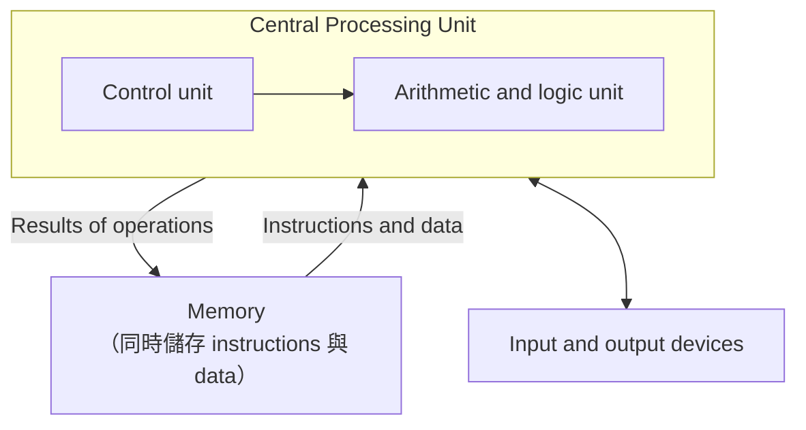

# 1.4–1.6 語言設計的影響、語言分類與設計取捨（Influences, Categories & Trade-Offs）

> Programming Languages — Chapter 1: Preliminaries（NUK 資工系 余亞儒教授講義，Slides 1-18 ~ 1-25、1-32）

---

## 本節涵蓋主題

| 主題 | 說明 |
|---|---|
| 電腦架構的影響 | von Neumann 架構造就指令式語言 |
| Fetch-execute cycle | 機器碼在 von Neumann 架構上的執行流程 |
| von Neumann bottleneck | 記憶體與 CPU 間的傳輸速度限制 |
| 程式設計方法論的影響 | 效率 → 結構化 → 抽象化 → 物件導向 |
| 語言分類 | Imperative、Functional、Logic、OO、Markup |
| 設計取捨 | 各評估準則之間的衝突 |

---

## 1. 語言設計的兩大影響（Influences on Language Design）

| 影響因素 | 說明 |
|---|---|
| Computer Architecture（電腦架構） | 語言圍繞主流架構發展，也就是 **von Neumann architecture** |
| Programming Methodologies（程式設計方法論） | 新的軟體開發方法（如物件導向）帶來新的程式設計典範（paradigm），進而產生新語言 |

---

## 2. 電腦架構的影響（Computer Architecture Influence）

### 2.1 von Neumann 架構



特點：

- 資料與程式**都存在記憶體**中
- 記憶體與 CPU **分離**
- 指令與資料必須從記憶體**傳送（piped）**到 CPU

### 2.2 為何指令式語言（Imperative Languages）最主流

因為 von Neumann 電腦是主流，指令式語言的核心特徵直接對應其硬體：

| 語言特徵 | 對應的硬體概念 |
|---|---|
| Variables（變數） | 記憶體單元（memory cells） |
| Assignment statements（指派敘述） | 記憶體與 CPU 間的資料傳送（piping） |
| Iteration（迴圈） | 很有效率：指令存在**相鄰記憶體**中，重複執行只需一道 **branch** 指令 |

> 反之，遞迴（recursion）在 von Neumann 架構上通常比迴圈慢，這也是函數式語言較難在此架構上高效執行的原因之一。

### 2.3 機器碼的執行：Fetch-Execute Cycle

下一道要執行的指令位址存在 **program counter（PC）** 暫存器中。

```text
initialize the program counter
repeat forever
    fetch   the instruction pointed by the counter   // 取指令
    increment the counter                             // PC 指向下一道
    decode  the instruction                           // 解碼
    execute the instruction                           // 執行
end repeat
```

> 注意順序：**fetch 之後、decode 之前**就先 increment PC。遇到 branch 指令時，execute 階段會再改寫 PC。

### 2.4 von Neumann 瓶頸（von Neumann Bottleneck）

- 電腦速度取決於**記憶體與處理器之間的連接速度**
- 處理器執行指令的速度往往**遠快於**這個連接速度 → 形成瓶頸（bottleneck）
- 這是限制電腦速度的**主要因素**

---

## 3. 程式設計方法論的影響（Programming Methodologies Influences）

| 年代 | 重點 | 代表概念 |
|---|---|---|
| 1950s ~ 1960s 初 | 應用簡單，關注**機器效率** | — |
| 1960s 後期 | **人的效率**變重要：易讀性、更好的控制結構 | 結構化程式設計（structured programming）、top-down design、stepwise refinement |
| 1970s 後期 | 從**程序導向**轉為**資料導向** | 資料抽象化（data abstraction） |
| 1980s 中期 | 物件導向程式設計 | data abstraction + inheritance + polymorphism |

> 演進口訣：**效率 → 結構化 → 抽象化 → 物件導向 → …**

---

## 4. 語言分類（Language Categories）

| 分類 | 代表語言 | 核心特徵 |
|---|---|---|
| Imperative（指令式） | C、Pascal | 變數、指派敘述、迴圈 |
| Functional（函數式） | LISP、Scheme | 主要運算方式是**將函數套用到參數上** |
| Logic（邏輯式） | Prolog | Rule-based，規則**不需依特定順序**撰寫 |
| Object-oriented（物件導向） | Java、C++ | data abstraction、inheritance、late binding |
| Markup（標記） | XHTML、XML | 描述 Web 文件中資訊的版面配置 |

> Markup 語言本身沒有運算能力，嚴格來說不算程式語言；列入分類是因為常與程式語言搭配使用。

---

## 5. 語言設計取捨（Language Design Trade-Offs）

評估準則之間常互相衝突，設計語言時必須取捨。

### 5.1 Reliability vs. Cost of Execution

Java 要求所有陣列存取都要檢查索引是否合法，提高可靠度，但增加執行成本。

```c
int i, a[10];
...
a[i]++;   // Java：執行期檢查 i 是否介於 0 ~ 9，越界則丟出例外
          // C：不檢查，越界存取不會被發現 → 較快但不可靠
```

### 5.2 Readability vs. Writability

APL 提供大量強力的陣列運算子與特殊符號，複雜運算可以寫得非常精簡，但易讀性極差。

```apl
+/⍳10    ⍝ 計算 1 到 10 的總和：⍳10 產生 1..10，+/ 將其全部相加
```

### 5.3 Writability（Flexibility） vs. Reliability

C++ 指標功能強大且彈性高，但容易誤用。

```cpp
int *p = new int(5);
delete p;
*p = 10;   // 錯誤：dangling pointer，存取已釋放的記憶體，編譯器不會報錯
```

---

## 重點整理

| 概念 | 重點 | 注意事項 |
|---|---|---|
| von Neumann 架構 | 程式與資料同存記憶體，記憶體與 CPU 分離 | 是指令式語言主流的原因 |
| 變數 / 指派 / 迴圈 | 對應記憶體單元 / 資料傳送 / 相鄰指令 + branch | 迴圈在此架構上很有效率 |
| Fetch-execute cycle | fetch → increment PC → decode → execute | PC 在 decode 前就遞增 |
| von Neumann bottleneck | 記憶體與 CPU 的傳輸速度限制整體速度 | 主要限制因素 |
| 方法論演進 | 機器效率 → 人的效率 → 資料導向 → OOP | OOP = 資料抽象 + 繼承 + 多型 |
| 語言分類 | Imperative / Functional / Logic / OO / Markup | Logic 規則無順序；Markup 無運算能力 |
| 設計取捨 | Reliability ↔ 執行成本、Readability ↔ Writability、Writability ↔ Reliability | 例子：Java 陣列檢查、APL、C++ 指標 |
