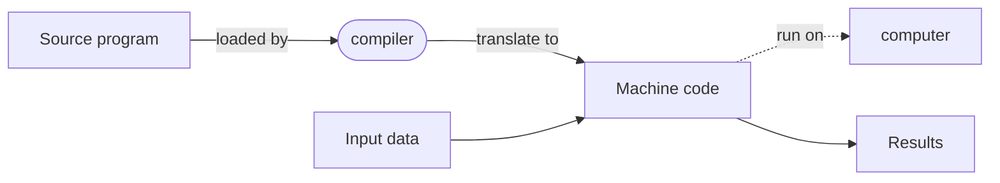
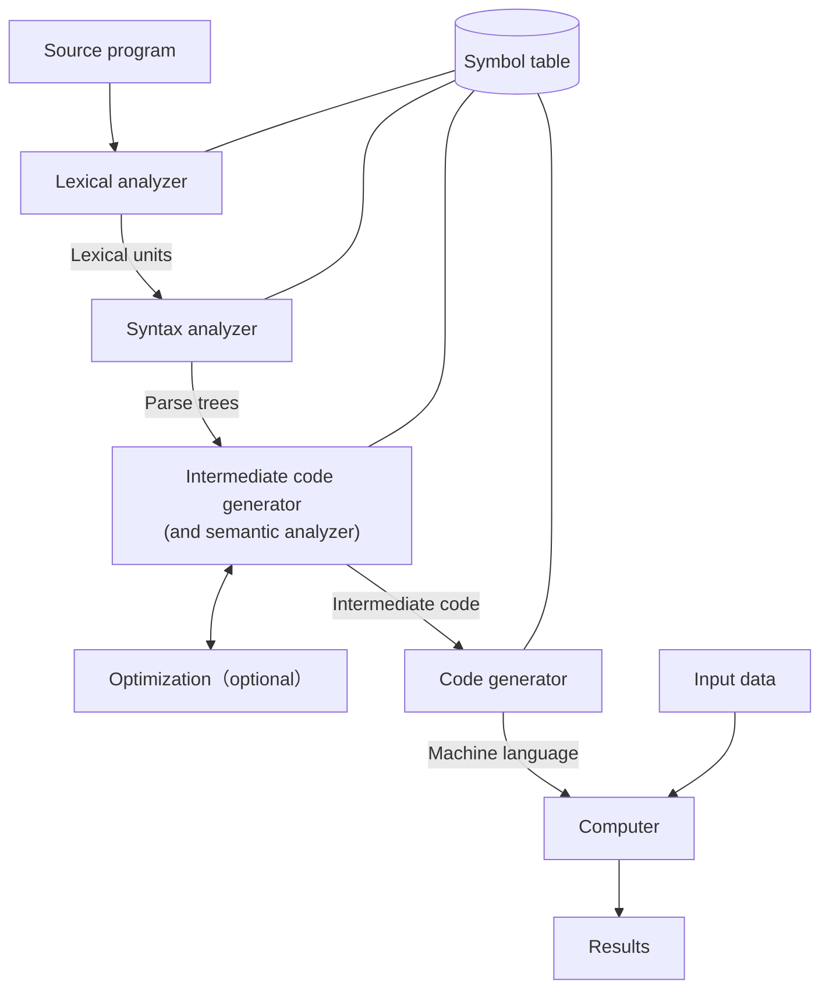
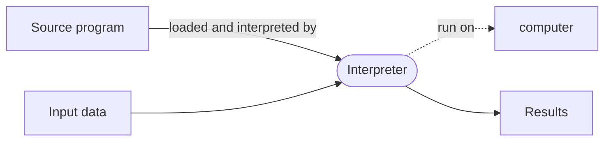
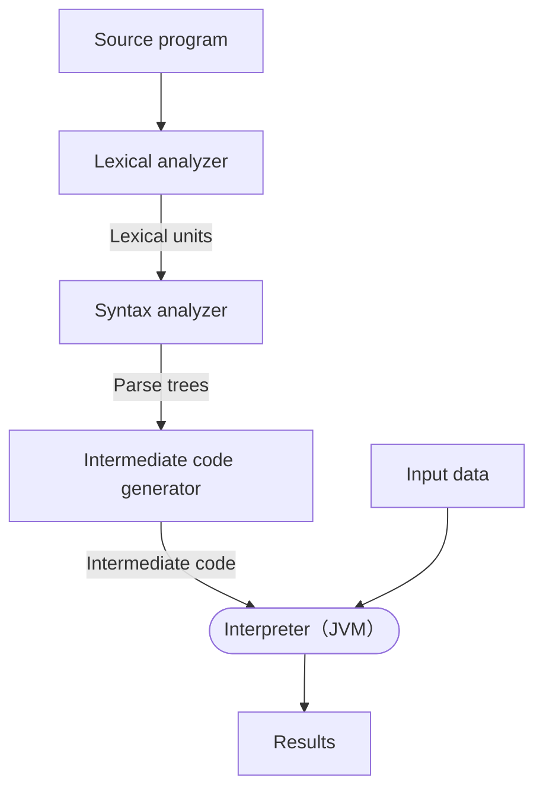

# 1.7–1.8 實作方法與程式設計環境（Implementation Methods & Programming Environments）

> Programming Languages — Chapter 1: Preliminaries（NUK 資工系 余亞儒教授講義，Slides 1-26 ~ 1-41）

---

## 本節涵蓋主題

| 主題 | 說明 |
|---|---|
| 虛擬電腦分層 | 作業系統與語言實作疊在機器介面之上 |
| 編譯（Compilation） | 翻譯成機器碼；翻譯慢、執行快 |
| 編譯階段 | Lexical → Syntax → Semantic → Code generation |
| 連結與載入 | 將系統程式連結到使用者程式 |
| 純解譯（Pure Interpretation） | 不翻譯，由直譯器逐句執行 |
| 混合式（Hybrid） | 翻成中間碼再解譯；Java bytecode |
| JIT | 執行時把中間碼編成機器碼並保留 |
| 前置處理器（Preprocessor） | 編譯前展開巨集 |
| 程式設計環境 | 軟體開發工具的集合 |

---

## 1. 三種實作方法（Implementation Methods）

| 方法 | 說明 |
|---|---|
| Compilation（編譯） | 程式被翻譯成機器語言 |
| Pure Interpretation（純解譯／直譯） | 程式由另一個稱為 interpreter 的程式解譯執行 |
| Hybrid Implementation Systems（混合式） | 介於編譯器與純直譯器之間的折衷 |

---

## 2. 虛擬電腦的分層介面（Layered Interface of Virtual Computers）

- 作業系統與語言實作**分層疊在電腦的機器介面之上**
- 每一層都可以視為一台**虛擬電腦（virtual computer）**

由內而外：

| 層 | 內容 |
|---|---|
| 最內層 | Bare machine（裸機） |
| 第二層 | Macroinstruction interpreter |
| 第三層 | Operating system |
| 最外層 | 各語言的 compiler / interpreter / assembler（C、C++、FORTRAN、Ada、LISP interpreter…） |

> 例如：對 C 程式設計師而言，「C compiler + 作業系統 + 硬體」整體就是一台 **virtual C computer**。

---

## 3. 編譯（Compilation）

- 將高階程式（source language）翻譯成**機器碼（machine language）**
- **翻譯慢，執行快（Slow translation, fast execution）**



### 3.1 編譯階段（Compilation Phases）

| 階段 | 中文 | 工作內容 | 產出 |
|---|---|---|---|
| Lexical analysis | 語彙分析 | 把原始碼字元切成 lexical units（identifiers、special words、operators、punctuation） | Lexical units |
| Syntax analysis | 語法分析 | 把 lexical units 轉成表示語法結構的 **parse trees** | Parse trees |
| Semantic analysis | 語意分析 | 產生中間碼（常類似組合語言），並檢查型別錯誤等 | Intermediate code |
| Optimization（選用） | 最佳化 | 讓程式（通常是中間碼）更小、更快或兩者皆是 | 最佳化後中間碼 |
| Code generation | 程式碼產生 | 產生機器碼 | Machine language |

**Symbol table**：作為整個編譯過程的資料庫，存放使用者定義名稱的型別與屬性，供各階段查詢。

Lexical analysis 範例：

```c
sum = sum + 1;
// 切成 lexical units：
// sum (identifier)  = (operator)  sum (identifier)  + (operator)  1 (literal)  ; (punctuation)
```

### 3.2 編譯流程圖（The Compilation Process）



### 3.3 其他編譯術語（Additional Compilation Terminologies）

| 術語 | 說明 |
|---|---|
| System codes | 編譯器產生的機器碼必須搭配系統程式（如 I/O 函式庫）才能執行 |
| Load module（executable image） | 使用者程式碼與系統程式碼**合在一起**的可執行檔 |
| Linking and loading | 收集系統程式並連結到使用者程式的過程，由 **linker** 完成 |

---

## 4. 純解譯（Pure Interpretation）



| 特性 | 說明 |
|---|---|
| No translation | 不翻譯成機器碼 |
| 容易除錯 | run-time error 能立即、清楚地顯示（可對應到原始碼） |
| **執行較慢** | 比編譯式慢 **10 ~ 100 倍** |
| 瓶頸 | **statement decoding**（每次執行都要重新解碼敘述） |
| **較耗記憶體** | 需保存符號表與原始碼 |
| 趨勢 | 在高階語言中漸少見，但隨 Web 腳本語言（JavaScript、PHP）**大幅回歸** |

> 注意兩種 bottleneck 的區別：編譯式程式受 **von Neumann bottleneck** 限制；純解譯受 **statement decoding** 限制。

---

## 5. 混合式實作（Hybrid Implementation Systems）

- 編譯器與純直譯器之間的**折衷**
- 高階程式先翻譯成**容易解譯的中間語言（intermediate language）**，再由直譯器執行
- **比純解譯快**



範例：

| 語言 | 說明 |
|---|---|
| Perl | 先部分編譯以偵測錯誤，再解譯 |
| Java（早期實作） | 中間形式為 **byte code**；任何具備 byte code interpreter 與 run-time system 的機器都能執行 → **可攜性**。兩者合稱 **Java Virtual Machine（JVM）** |

---

## 6. Just-in-Time 實作系統（JIT）

1. 先將程式翻成中間語言
2. **執行期間**，某個 method **被呼叫時**才把它編譯成機器碼
3. 編好的機器碼**保留下來**，之後再呼叫就直接使用

- JIT 廣泛用於 Java
- .NET 語言也以 JIT 系統實作

### 傳統 JVM 與 JIT 的差別（講義 Slide 38）

| | 傳統 JVM | JIT JVM |
|---|---|---|
| 翻譯方式 | 一道 bytecode 翻成機器碼 → 執行 → **丟掉** | 常執行的部分第一次翻好後**存在記憶體** |
| 重複執行 | 每次都要重新翻譯 | 直接從記憶體取出機器碼執行 |
| 效率 | 差 | 記憶體夠大、JIT 技術夠好時，可**逼近純編譯式程式** |

> 核心概念：**以記憶體空間換取執行時間**。

---

## 7. 前置處理器（Preprocessors）

- 前置處理器在程式**編譯之前**處理程式，展開內嵌的 **preprocessor macros**
- 巨集常用於**引入其他檔案的程式碼**
- 又稱前編譯器（pre-compiler）或前翻譯器（pretranslator）：把原始碼中**不符合語言規範的部分轉換成符合規範的形式**，再交給編譯器

```c
#include "myLib.c"                        // 將 myLib.c 的內容整份插入此處

#define max(A,B) ((A) > (B) ? (A) : (B))  // 定義巨集
...
x = max(2 * y, z / 1.73);
// 展開後（純文字替換）：
// x = ((2 * y) > (z / 1.73) ? (2 * y) : (z / 1.73));
```

> 巨集是**文字替換**而非函數呼叫。例如 `max(i++, j)` 展開後 `i++` 可能被執行兩次，這是常見陷阱。

---

## 8. 程式設計環境（Programming Environments）

程式設計環境是軟體開發所用**工具（tools）的集合**。

| 環境 | 說明 |
|---|---|
| UNIX | 較早期的作業系統與工具集合；現今常透過 GUI（CDE、KDE、GNOME）使用 |
| Borland JBuilder、Eclipse | Java 的整合開發環境（IDE） |
| Microsoft Visual Studio .NET | 大型、複雜的視覺化環境，可用於 C#、Visual BASIC.NET、JScript、J#、C++ |

---

## 重點整理

### 實作方法比較

| 方法 | 流程 | 翻譯速度 | 執行速度 | 代表 |
|---|---|---|---|---|
| Compilation | 原始碼 → 機器碼 → 執行 | 慢 | **最快** | C、C++、FORTRAN |
| Pure interpretation | 直譯器逐句解碼執行 | 無翻譯 | **最慢**（10–100 倍） | 早期 LISP、早期 JavaScript、PHP |
| Hybrid | 原始碼 → 中間碼 → 直譯 | 中 | 中（快於純解譯） | Perl、早期 Java |
| JIT | 中間碼 → 呼叫時編成機器碼並保留 | 中 | 接近編譯式 | Java、.NET |

### 名詞速查

| 名詞 | 一句話定義 |
|---|---|
| Lexical unit | 語彙分析切出的最小單位（識別字、保留字、運算子、標點） |
| Parse tree | 表示程式語法結構的樹 |
| Symbol table | 編譯過程的資料庫，存放名稱的型別與屬性 |
| Load module | 使用者程式 + 系統程式合成的可執行檔 |
| Linker | 負責收集系統程式並連結到使用者程式 |
| Byte code | Java 的中間碼，提供可攜性 |
| JVM | byte code interpreter + run-time system |
| Preprocessor | 編譯前展開巨集的程式 |

### 整章 Summary（講義 1-42）

| 主題 | 結論 |
|---|---|
| 研讀理由 | 增加使用不同 constructs 的能力、更聰明地選語言、更容易學新語言 |
| 評估準則 | Readability、Writability、Reliability、Cost |
| 設計影響 | 機器架構與軟體開發方法論 |
| 實作方法 | Compilation、Pure interpretation、Hybrid implementation |
