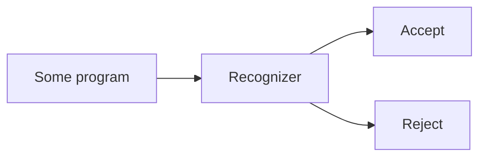
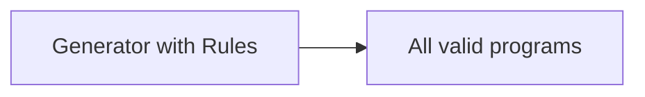

# 3.1–3.2 語言與文法、描述語法的基本問題（Introduction & The General Problem of Describing Syntax）

> Programming Languages — Chapter 3: Describing Syntax（NUK 資工系 余亞儒教授講義 Ch3-1，Slides 3 ~ 3-9）

---

## 本節涵蓋主題

| 主題 | 說明 |
|---|---|
| Language 與 Grammar | 語言是字串集合；文法是產生該集合的規則 |
| Syntax vs. Semantics | 形式結構 vs. 意義 |
| 基本術語 | sentence、language、lexeme、token |
| Lexeme 與 Token 範例 | 拆解 `index = 2 * count + 17;` |
| Recognizer | 讀入字串，判斷是否屬於該語言 |
| Generator | 依規則產生該語言的所有句子 |

---

## 1. Language 與 Grammar

### 1.1 Language 是一個字串集合

每種語言都建立在一組字元（alphabet）之上，語言就是由這些字元組成的**合法字串的集合**。

| 語言 | 使用的字元 | 例子 |
|---|---|---|
| 聖經人名 | 52 個大小寫英文字母 | `Aaron` |
| English | 52 個大小寫英文字母、標點符號 | — |
| Chinese | 漢字，約七萬字 | — |
| C Programming Language | ASCII 可見符號、換行、空白等 | 見下方 |

```c
int main()
{
    return 0;
}
```

整段 C 程式也只是一個字串，它屬於「C 語言」這個字串集合。

### 1.2 Grammar 是一組規則

- Grammar 用**少量規則**描述（構築）出一大堆字串，也就是一套 Language
- 同一套 Language 可以設計出**許多種不同的 Grammar**

> Grammar 必須**剛好**生成 Language 之內的所有字串，且**永不**生成 Language 以外的任何字串。

---

## 2. Syntax 與 Semantics

| 名詞 | 定義 | 關注的問題 |
|---|---|---|
| **Syntax**（語法） | the **form** or **structure** of the expressions, statements, and program units | 程式「長得對不對」 |
| **Semantics**（語意） | the **meaning** of the expressions, statements, and program units | 程式「代表什麼意思」 |

例：C 的 `while (<boolean_expr>) <statement>`

- Syntax：關鍵字 `while`、括號內的布林運算式、接著一個敘述
- Semantics：布林運算式為 true 時執行敘述，然後回到運算式重新判斷

---

## 3. 基本術語（Terminology）

| 術語 | 定義 | 例子 |
|---|---|---|
| Sentence（句子） | 由某個 alphabet 中字元組成的字串 | `a = b + 1;` |
| Language（語言） | **句子的集合** | 所有合法 C 程式 |
| Lexeme（詞位） | 語言中**最低層級**的語法單位 | `*`、`sum`、`begin` |
| Token（記號） | **一類 lexeme 的名稱** | identifier、arithmetic operator |

> 關係：lexeme 是「實際出現的字」，token 是「它屬於哪一類」。多個 lexeme 可以屬於同一個 token（`index`、`count` 都是 identifier）。

### 3.1 範例：`index = 2 * count + 17;`

| Lexeme | Token |
|---|---|
| `index` | identifier |
| `=` | equal_sign |
| `2` | int_literal |
| `*` | multi_op |
| `count` | identifier |
| `+` | plus_op |
| `17` | int_literal |
| `;` | semicolon |

- 有些語言的 token 種類很少且形式簡單
- C 有超過 100 種 token，其中包含 44 個 keywords（`if`、`return` 等）

---

## 4. 定義語言的兩種方式

### 4.1 Recognizer（辨識器）

- 讀入字串，**判斷**該字串是否屬於這個語言
- 例：編譯器的語法分析（syntax analysis）部分，詳見 Chapter 4



### 4.2 Generator（產生器）

- 依照規則**產生**語言中的句子
- 可用來判斷某個句子的語法是否正確：看它能否被規則產生出來



| | Recognizer | Generator |
|---|---|---|
| 方向 | 輸入字串 → 判斷是否合法 | 規則 → 產生所有合法字串 |
| 典型代表 | 編譯器的 parser | Grammar（BNF） |
| 對應章節 | Chapter 4 | 本章 BNF |

> Grammar 本身是 generator；由 context-free grammar 可以自動產生對應的 recognizer（parser），兩者描述的是同一個語言。

---

## 重點整理

| 概念 | 一句話定義 | 注意事項 |
|---|---|---|
| Language | 句子（字串）的集合 | 建立在某個 alphabet 之上 |
| Grammar | 產生 Language 的一組規則 | 一個語言可有多種 grammar；必須剛好生成該語言 |
| Syntax | 形式與結構 | 「長得對不對」 |
| Semantics | 意義 | 「代表什麼」 |
| Lexeme | 最低層級的語法單位 | 實際出現的字，如 `sum` |
| Token | lexeme 的類別 | 如 identifier |
| Recognizer | 判斷字串是否屬於語言 | 編譯器的 syntax analyzer |
| Generator | 產生語言的所有句子 | 如 BNF 文法 |
