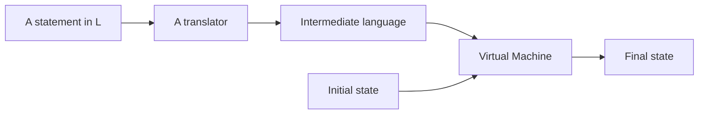
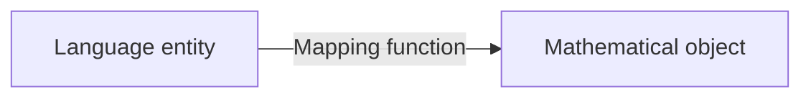

# 3.5 動態語意（一）：操作語意與指稱語意（Operational & Denotational Semantics）

> Programming Languages — Chapter 3: Describing Semantics（NUK 資工系 余亞儒教授講義 Ch3-2，Slides 3-28 ~ 3-50）

---

## 本節涵蓋主題

| 主題 | 說明 |
|---|---|
| Dynamic semantics 概覽 | 沒有通用標準記法，課程介紹三種方法 |
| Operational semantics | 把程式翻成較易懂的低階語言，以狀態變化描述意義 |
| VDL | IBM 以操作語意定義 PL/I 的形式語言 |
| Denotational semantics | 把語言元素映射到數學物件 |
| Program state 與 VARMAP | 變數名稱與值的集合 |
| 範例 | 十進位數字、簡單運算式、指派、while 迴圈 |
| 評價 | 兩種方法各自的優缺點 |

---

## 1. Dynamic Semantics 概覽

- 描述 expressions、statements、program units 的**意義**
- **沒有**單一、被廣泛接受的記法
- 課程介紹三種方法：

| 方法 | 中文 | 核心想法 |
|---|---|---|
| Operational Semantics（Interpretive Semantics） | 操作語意 | 用低階語言描述高階語言，意義 = **狀態變化** |
| Denotational Semantics | 指稱語意（講義：符號型語意） | 意義 = **數學物件**（函數） |
| Axiomatic Semantics | 公理型語意 | 意義 = **邏輯斷言**（前後條件） |

---

## 2. 操作語意（Operational Semantics）

### 2.1 基本概念

把程式**翻譯成較容易理解的語言**來描述其意義（用低階語言描述高階語言的意義）。

| 層級 | 關注點 |
|---|---|
| Natural operational semantics | **整個程式**的最終結果 |
| Structural operational semantics | **單一敘述**的精確意義 |

### 2.2 需要一台虛擬機器

要對高階語言使用操作語意，需要一台 virtual machine：

| 方案 | 問題 |
|---|---|
| 硬體純直譯器 | 太昂貴 |
| 軟體純直譯器 | 語意定義會**依賴機器**、太複雜、不可移植 |
| **完整電腦模擬（較好）** | 建一個 translator（原始碼 → 理想化電腦的機器碼），再建一個該理想化電腦的 simulator |

### 2.3 基本流程

1. 設計適當的**中間語言**
   - 最重要的特性：**清楚（clarity）**
   - 機器語言太低階，不易理解
2. 若採 natural operational semantics，必須為中間語言建一台虛擬機器（直譯器）；structural operational semantics 不一定需要



> **Semantics = State change**：敘述的意義就是它讓機器狀態從初始狀態變成什麼最終狀態。

### 2.4 範例：C 的 `for` 迴圈

```c
for (expr1; expr2; expr3) {
    ...
}
```

翻譯成操作語意：

```text
        expr1;
loop:   if expr2 == 0 goto out
        ...
        expr3;
        goto loop
out:    ...
```

人作為一台「虛擬電腦」，讀這段低階描述就能理解 `for` 的意義。

### 2.5 Vienna Definition Language（VDL）

- IBM **維也納實驗室**約於 **1969 年**研製的形式語言，以操作語意做形式化定義
- 用來描述 **PL/I** 的語意
- VDL 版的 PL/I 規格非常龐大、非常複雜，是了不起的技術成就，但**實用價值很低**

### 2.6 評價

| 面向 | 評價 |
|---|---|
| 非正式使用（語言手冊、教科書、教學） | **好用**，對語言使用者與實作者都有效 |
| 正式使用（如 VDL） | **極度複雜** |
| 基礎 | 依賴**較低階的程式語言**，而非數學 |

---

## 3. 指稱語意（Denotational Semantics）

### 3.1 基本概念

- 以 **recursive function theory** 為基礎
- **最抽象**的語意描述方法
- 對每個語言元素：
  1. 定義一個**數學物件**（如整數）
  2. 定義一個**映射函數**，把語言元素的實例對應到數學物件的實例



| | Operational | Denotational |
|---|---|---|
| 語言結構被轉換成… | **較簡單的程式語言結構** | **數學物件** |
| 基礎 | 低階語言 | 數學（遞迴函數） |

### 3.2 程式狀態（Program State）

程式的 state 是**所有目前變數的值**：

```text
s = {<i1, v1>, <i2, v2>, …, <in, vn>}     ; i 為變數名稱，v 為目前的值
s = {<a, 4>, <i, -2>, …, <k, 3.6>}
```

**VARMAP**：給定變數名稱與 state，回傳該變數目前的值。

```text
VARMAP(ij, s) = vj
VARMAP(k, s)  = 3.6       ; 在 state s 下，變數 k 的值為 3.6
```

### 3.3 範例：十進位數字

文法（EBNF）：

```text
<dec_num> → 0 | 1 | 2 | 3 | 4 | 5 | 6 | 7 | 8 | 9
          | <dec_num> (0 | 1 | 2 | 3 | 4 | 5 | 6 | 7 | 8 | 9)
```

映射函數 `Mdec`：`<dec_num>` → integer

```text
Mdec('0') = 0,  Mdec('1') = 1,  …,  Mdec('9') = 9
Mdec(<dec_num> '0') = 10 * Mdec(<dec_num>)
Mdec(<dec_num> '1') = 10 * Mdec(<dec_num>) + 1
…
Mdec(<dec_num> '9') = 10 * Mdec(<dec_num>) + 9
```

計算 `'491'`：

```text
Mdec('491') = 10 * Mdec('49') + 1
            = 10 * (10 * Mdec('4') + 9) + 1
            = 10 * (10 * 4 + 9) + 1
            = 491
```

> 字串 `'491'`（語法）被映射成整數 491（數學物件）。

### 3.4 範例：簡單運算式

設定：

- 運算式映射到 **Z ∪ {error}**（Z 為整數集合，error 為錯誤值）
- 運算式是十進位數字、變數，或 binary expression
- binary expression 只有一個運算子（`+` 或 `*`）和兩個運算元
- 運算元是十進位數字或變數；沒有括號

```text
<expr>        → <dec_num> | <var> | <binary_expr>
<binary_expr> → <left_expr> <operator> <right_expr>
<left_expr>   → <dec_num> | <var>
<right_expr>  → <dec_num> | <var>
<operator>    → + | *
```

映射函數 `Me`：

```text
Me(<expr>, s) = case <expr> of
    <dec_num>     => Mdec(<dec_num>, s)
    <var>         => if VARMAP(<var>, s) == undef
                         then error
                         else VARMAP(<var>, s)
    <binary_expr> =>
        if (Me(<binary_expr>.<left_expr>, s) == undef OR
            Me(<binary_expr>.<right_expr>, s) == undef)
            then error
        else if (<binary_expr>.<operator> == '+')
            then Me(<binary_expr>.<left_expr>, s) + Me(<binary_expr>.<right_expr>, s)
        else Me(<binary_expr>.<left_expr>, s) * Me(<binary_expr>.<right_expr>, s)
```

> 講義在 binary_expr 分支比較 `== undef`；Sebesta 課本寫 `== error`，因為 `Me` 的回傳值是 Z ∪ {error}，比較 error 較精確。

### 3.5 範例：指派敘述（Assignment）

`Ma`：state → state

```text
Ma(x := E, s) = if Me(E, s) == error
                    then error
                    else s' = {<i1, v1'>, <i2, v2'>, …, <in, vn'>}
                         where for j = 1, 2, …, n,
                             vj' = VARMAP(ij, s)   if ij <> x    ; 不是被指派的變數 → 值不變
                                 = Me(E, s)        if ij == x    ; 被指派的變數 → 新值
```

例：

```text
s  = {<a, 4>, <i, -2>, …, <k, 3.6>}
a := i * 2 + 18;              ; -2 * 2 + 18 = 14
s' = {<a, 14>, <i, -2>, …, <k, 3.6>}
```

### 3.6 範例：邏輯前測迴圈（while）

`Ml`：state → state

```text
Ml(while B do L, s) =
    if Mb(B, s) == undef
        then error
    else if Mb(B, s) == false
        then s                                   ; 條件不成立 → state 不變
    else if Msl(L, s) == error
        then error
    else Ml(while B do L, Msl(L, s))             ; 執行一次 body 後，遞迴處理剩下的迴圈
```

- `Mb`：Boolean expression → Boolean 值
- `Msl`：statement list → state

**追蹤範例：**

```text
s = {<a, 4>, <i, -2>, …}
while i < 0 do
    i := i + 1;
```

| 步驟 | 目前 state 中的 i | `Mb(i < 0)` | 動作 |
|---|---|---|---|
| 1 | -2 | true | `Ml(while…, Msl(L, s))`，`Msl` 對應到 `Ma(i := i + 1, s)` → s' |
| 2 | -1 | true | `Ml(while…, Msl(L, s'))` → s'' |
| 3 | 0 | false | 回傳 s'' = {<a, 4>, <i, 0>, …} |

### 3.7 迴圈的意義

- 迴圈的意義 = 迴圈本體執行完規定次數後，**所有程式變數的值**（假設沒有錯誤）
- 本質上是把**迭代（iteration）轉換成遞迴（recursion）**
- 遞迴比迭代**更容易用數學嚴謹描述**

### 3.8 評價

| 面向 | 評價 |
|---|---|
| 正確性 | 可用來**證明程式的正確性** |
| 思考方式 | 提供嚴謹思考程式的方法 |
| 語言設計 | 可輔助語言設計 |
| 編譯器 | 曾用於編譯器產生系統 |
| 缺點 | 太複雜，對**語言使用者**幫助不大 |

> History note：有大量研究嘗試用指稱語意描述**自動產生編譯器**，證明方法可行，但從未發展到能產生實用編譯器的程度。

---

## 重點整理

| 概念 | 重點 | 注意事項 |
|---|---|---|
| Operational semantics | 翻成低階中間語言，意義 = 狀態變化 | 非正式使用好用，正式使用極複雜 |
| Natural vs. structural | 整個程式結果 vs. 單一敘述意義 | natural 需要中間語言的虛擬機器 |
| VDL | IBM 維也納實驗室，定義 PL/I | 龐大、複雜、實用性低 |
| Denotational semantics | 語言元素 → 數學物件的映射函數 | 最抽象；基於遞迴函數論 |
| State | 所有變數名稱與值的集合 | `VARMAP(i, s)` 取值 |
| `Mdec` | 數字字串 → 整數 | `Mdec('491') = 491` |
| `Me` | 運算式 → Z ∪ {error} | 變數未定義 → error |
| `Ma` | 指派：state → state | 只有被指派的變數值改變 |
| `Ml` | while：state → state | 迭代改寫成遞迴 |
| 兩者比較 | 轉成較簡單的程式 vs. 轉成數學物件 | 前者基於低階語言，後者基於數學 |
